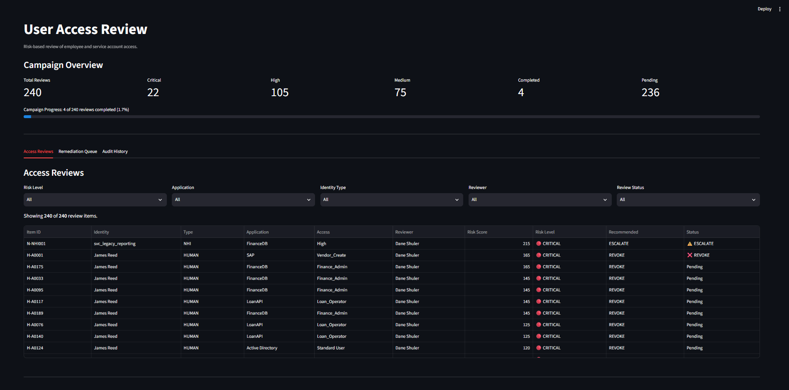
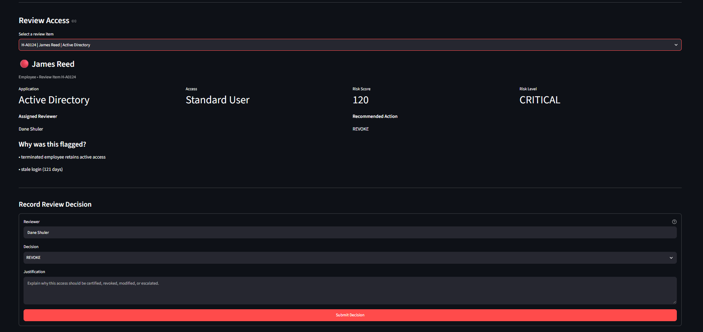
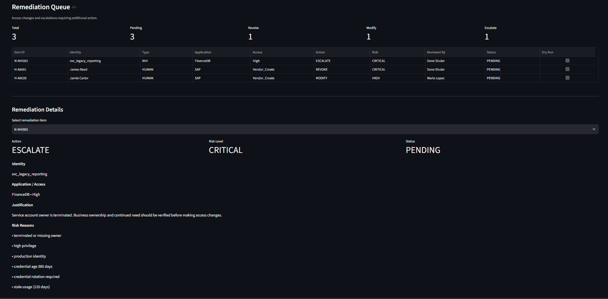
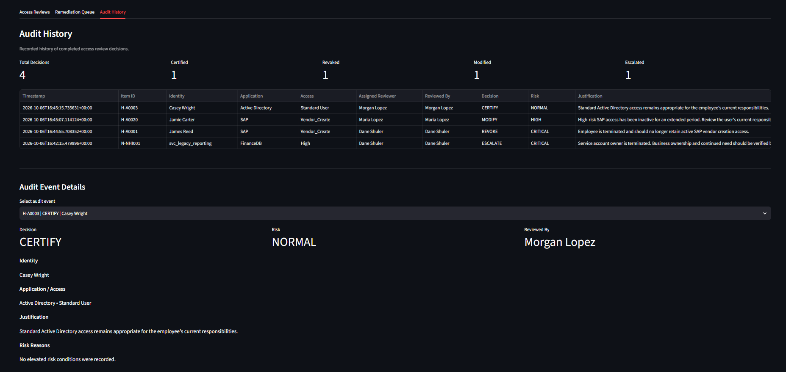

# Automated User Access Review

This is a proof-of-concept I built to explore how parts of the User Access Review process could be automated.

The goal is to take identity and access information from multiple sources, organize it into a review campaign, identify access that may need extra attention, assign the appropriate reviewer, and track decisions through remediation and audit history.

The project includes both a command-line interface and a Streamlit web dashboard where reviewers can investigate access and record review decisions.

> **Important:** All identities, accounts, applications, access assignments, and policies in this repository are synthetic. No real company or user data is used.

---

## Live Demo

The User Access Review dashboard is available as a hosted Streamlit demo:

### [Open the Live UAR Demo](https://automated-user-access-review.streamlit.app/)

The hosted application runs as an isolated demonstration environment. All identities, applications, access assignments, and review information are synthetic.

Each visitor receives their own demo session, so review decisions can be submitted without modifying the repository or affecting other users. The demo can also be reset to its original state at any time.

The application does not connect to or modify any production identity systems.

---

## Dashboard

I built a Streamlit dashboard on top of the review process so the campaign can be worked through like an actual access review instead of only viewing generated CSV files.

The dashboard includes:

- Campaign progress and risk totals
- Filtering by risk, application, identity type, reviewer, and review status
- Individual access review details
- Explanations showing why access was flagged
- Reviewer assignment and authorization
- CERTIFY, REVOKE, MODIFY, and ESCALATE decisions
- Remediation tracking
- Audit history
- Isolated demo sessions
- Demo reset functionality

### Access Review Campaign



The main dashboard provides an overview of the current campaign. Reviews are prioritized by risk and can be filtered by risk level, application, identity type, assigned reviewer, or completion status.

This makes it possible to quickly narrow a large campaign down to the access that deserves attention first.

### Reviewing an Access Item



Selecting an item opens the individual review workspace.

The reviewer can see:

- Who or what has the access
- The application and entitlement being reviewed
- Risk score and risk level
- Assigned reviewer
- Recommended action
- Each condition that contributed to the risk score

For example, a terminated employee who still has an active account can be assigned a **CRITICAL** risk level with a recommended action of **REVOKE**.

The assigned reviewer can then choose **CERTIFY**, **REVOKE**, **MODIFY**, or **ESCALATE** and must provide a justification before submitting the decision.

### Remediation Queue



Decisions that require additional action are sent to a separate remediation queue.

A **REVOKE**, **MODIFY**, or **ESCALATE** decision creates a remediation item containing the original access information, reviewer decision, justification, risk level, and reasons the access was flagged.

The proof of concept intentionally operates in dry-run mode. It demonstrates where an automated remediation process could continue without making changes to a real identity system.

### Audit History



Every completed review is also recorded in the audit history.

The audit trail records the assigned reviewer, person who completed the review, decision, justification, identity, application, access, risk information, and timestamp.

This provides evidence of both the original access review and the human decision that followed it.

The example campaign includes all four possible outcomes:

- **CERTIFY** for access that remains appropriate
- **REVOKE** for access that should be removed
- **MODIFY** for access that needs to be changed
- **ESCALATE** when additional investigation or approval is needed

---

## How It Works

The program starts with four sets of information:

- Employee information, including department, manager, and employment status
- Employee application access, similar to information that could come from Saviynt
- Service accounts and other non-human identities, similar to information that could come from Oasis
- Application information, including application owners and review requirements

The program combines this information and looks for situations that may deserve additional attention.

Examples include:

- A terminated employee who still has active access
- High-risk or critical access
- Access to applications covered by SOX controls
- Accounts that have not been used recently
- Service accounts owned by terminated employees
- Highly privileged service accounts
- Old credentials that may need to be rotated
- Production service accounts that deserve additional review

Each access item receives a risk score and an explanation showing why it was flagged. The program then determines who should review the access and creates the User Access Review campaign.

---

## Review Workflow

```text
Employee / HR Information ───────┐
                                 │
Employee Access / Saviynt ───────┤
                                 │
Service Accounts / Oasis ────────┼──> Normalize Access
                                 │          │
Application Information ─────────┘          ↓
                                       Risk Scoring
                                            │
                                            ↓
                                    Reviewer Assignment
                                            │
                                            ↓
                                    User Access Review
                                            │
                       ┌────────────────────┼────────────────────┐
                       │                    │                    │
                    CERTIFY           REVOKE / MODIFY         ESCALATE
                       │                    │                    │
                       │                    └─────────┬──────────┘
                       │                              ↓
                       │                      Remediation Queue
                       │                              │
                       └──────────────┬───────────────┘
                                      ↓
                                  Audit History
```

One of the main design choices I made was keeping the review decision separate from the actual access change.

For example, choosing **REVOKE** does not immediately remove someone's access. Instead, it creates a remediation item that can be reviewed and processed separately.

This helps prevent an automated process from making a potentially disruptive access change without the proper checks in place.

---

## Review Decisions

A reviewer can make one of four decisions:

- **CERTIFY:** The access is still appropriate.
- **REVOKE:** The access should be removed.
- **MODIFY:** The access should be changed.
- **ESCALATE:** Additional investigation or approval is needed.

Every decision requires a justification.

The program also verifies that the person submitting the decision is the reviewer assigned to that access item. Once an item has been reviewed, duplicate decisions are prevented.

### Example Review Flow

A typical review looks like this:

1. Access information is collected from the synthetic source systems.
2. The risk engine evaluates the access.
3. The campaign assigns an appropriate reviewer.
4. The reviewer investigates why the access was flagged.
5. The reviewer records a decision and justification.
6. The decision is written to the audit history.
7. REVOKE, MODIFY, and ESCALATE decisions also enter the remediation queue.

This keeps the risk assessment, human decision, and remediation steps separate while maintaining a record of the entire process.

---

## Risk Scoring

Risk scoring helps reviewers prioritize which access deserves attention first.

For example, an active employee with standard access may receive little or no additional risk, while a terminated employee who still has active high-risk access will be pushed toward the top of the campaign.

### Human Access Risk Factors

The current human access rules consider factors such as:

- Employment status
- Whether an account remains active
- Access risk level
- Critical or high-risk entitlements
- SOX-controlled access
- Last login activity

### Service Account Risk Factors

Service and other non-human identity rules consider factors such as:

- Owner employment status
- Missing or terminated ownership
- Privilege level
- Production usage
- Credential age
- Credential rotation requirements
- Last account usage

Each applicable condition contributes to the item's risk score and is also stored as a readable risk reason.

For example:

```text
terminated employee retains active access
stale login (121 days)
```

or:

```text
terminated or missing owner
high privilege
production identity
credential age 380 days
credential rotation required
stale usage (120 days)
```

The risk score does **not** automatically determine whether access should remain or be removed.

The final decision is still made by an authorized reviewer.

The scoring values in this project are demonstration policies created for the proof of concept and are not presented as industry-standard thresholds.

---

## Reviewer Assignment

Reviewer assignment changes depending on the access being reviewed.

For example:

- Critical access can be routed to an IAM reviewer
- High-risk or SOX-related access can be routed to the application owner
- Lower-risk employee access can be routed to the employee's manager
- Service accounts can be routed based on application ownership or account ownership

The assigned reviewer is enforced when a decision is submitted.

If another person attempts to complete an assigned review, the program rejects the decision.

This helps demonstrate how reviewer assignment could be enforced rather than simply being informational.

---

## Remediation

Items marked **REVOKE**, **MODIFY**, or **ESCALATE** are added to the remediation queue.

The queue includes information such as:

- Identity
- Application
- Access
- Requested action
- Reviewer
- Justification
- Risk information
- Remediation status
- Dry-run status

The current project does not automatically execute the requested access change.

Instead, remediation items remain **PENDING** and are marked as dry-run actions.

This was an intentional design decision. A production implementation could later replace the dry-run step with integrations to the appropriate identity or application systems while preserving the review and audit workflow.

---

## Audit History

Every completed review creates an audit event containing information such as:

- Identity being reviewed
- Application and access
- Assigned reviewer
- Person who completed the review
- Decision
- Justification
- Risk score
- Risk level
- Reasons the access was flagged
- Timestamp

CERTIFY decisions are recorded in the audit history without creating remediation work.

This provides a historical record of who reviewed access, what they decided, and why they made that decision.

---

## Demo Environment

The hosted Streamlit version is intentionally separated from the persistent local workflow.

When a visitor opens the hosted application, the baseline demonstration data is copied into that visitor's Streamlit session.

```text
                    GitHub Repository
                           │
               ┌───────────┴───────────┐
               │                       │
               ↓                       ↓
          Local Project          Streamlit Demo
               │                       │
               ↓                       ↓
          output/*.csv            demo/*.csv
               │                       │
        Persistent local         Copied into each
            workflow             visitor's session
               │                       │
               ↓                       ↓
          main.py / CLI           app.py / Web UI
               │                       │
               ↓                       ↓
         Audit + Queue           Audit + Queue
         written to disk         temporary only
```

This allows visitors to:

- Submit review decisions
- Test reviewer authorization
- Add items to the remediation queue
- View changes in the audit history
- Reset the demonstration to its original state

Changes made through the hosted application exist only within that visitor's session and do not modify the baseline data in GitHub.

The local command-line workflow remains CSV-backed so the persistent output of the proof of concept can still be inspected.

---

## Example Data

The project currently generates:

- 50 employees
- 200 employee access assignments
- 40 service accounts and other non-human identities
- Several applications with different owners and security requirements

Some problems are deliberately included in the synthetic data so the program has realistic scenarios to identify.

Examples include a terminated employee who still has active application access and a privileged service account that is still owned by a terminated employee.

The repository also includes example output from a completed test workflow.

The sample results demonstrate **CERTIFY**, **REVOKE**, **MODIFY**, and **ESCALATE** decisions, along with the resulting audit history and remediation queue.

This makes it possible to review the full workflow without running the project first.

---

## Running the Project Locally

### 1. Clone the Repository

```bash
git clone https://github.com/DaneShuler/automated-user-access-review.git
cd automated-user-access-review
```

### 2. Create a Virtual Environment

Windows:

```bash
py -m venv .venv
.venv\Scripts\activate
```

macOS / Linux:

```bash
python3 -m venv .venv
source .venv/bin/activate
```

### 3. Install Requirements

```bash
python -m pip install -r requirements.txt
```

### 4. Generate Synthetic Data

```bash
python main.py generate
```

This creates the example employee, application, human access, and service account data.

### 5. Create the Review Campaign

```bash
python main.py campaign
```

The generated campaign is written to:

```text
output/review_campaign.csv
```

### 6. Start the Dashboard

```bash
python -m streamlit run app.py
```

Streamlit will provide a local address and open the User Access Review dashboard in a web browser.

---

## Command-Line Interface

The project can also be used from the command line.

### Generate Example Data

```bash
python main.py generate
```

### Create a Review Campaign

```bash
python main.py campaign
```

### Record a Decision

```bash
python main.py decide --item-id H-A0001 --reviewer "Dane Shuler" --decision REVOKE --justification "Employee is terminated and should no longer retain active access."
```

The command-line interface uses the persistent local CSV workflow, while the hosted Streamlit application uses isolated demonstration sessions.

---

## Project Structure

```text
automated-user-access-review/
│
├── app.py
├── main.py
├── config.json
├── requirements.txt
├── README.md
│
├── data/
│   ├── employees.csv
│   ├── applications.csv
│   ├── saviynt_access.csv
│   └── oasis_nhi.csv
│
├── demo/
│   ├── review_campaign.csv
│   ├── audit_log.csv
│   └── remediation_queue.csv
│
├── output/
│   ├── review_campaign.csv
│   ├── audit_log.csv
│   └── remediation_queue.csv
│
├── screenshots/
│   ├── access-reviews.png
│   ├── review-details.png
│   ├── remediation-queue.png
│   └── audit-history.png
│
├── src/
│   ├── __init__.py
│   ├── campaign.py
│   ├── connectors.py
│   ├── generate_data.py
│   ├── review.py
│   └── risk_engine.py
│
└── tests/
    └── test_risk_engine.py
```

### `app.py`

Provides the Streamlit web interface for viewing the campaign, investigating individual access items, recording decisions, reviewing remediation work, and viewing audit history.

The hosted application uses Streamlit session state so each visitor receives an isolated demonstration environment.

### `main.py`

Provides the command-line interface for generating data, creating campaigns, and recording decisions.

### `src/generate_data.py`

Creates the synthetic employees, access assignments, applications, and service accounts used by the proof of concept.

The generator also deliberately creates several access problems so the risk and review workflow can be demonstrated consistently.

### `src/connectors.py`

Provides the interface between the review process and its data sources.

The current connectors read CSV files, but they are separated from the rest of the review logic so they could later be replaced with integrations that retrieve information from identity platforms, HR systems, or other sources.

### `src/risk_engine.py`

Evaluates human and service account access for potential concerns and calculates risk scores.

It also records the reasons behind each score so reviewers can understand why an item was prioritized.

### `src/campaign.py`

Combines the different sources of information, calculates risk, assigns reviewers, provides recommendations, and creates the User Access Review campaign.

### `src/review.py`

Handles reviewer decisions, reviewer authorization, duplicate-review prevention, audit history, and remediation queue creation for the persistent local workflow.

### `config.json`

Contains configurable risk rules, scoring values, thresholds, IAM reviewer settings, and other review behavior.

### `demo/`

Contains the baseline campaign, audit history, and remediation queue used to initialize isolated Streamlit demonstration sessions.

### `output/`

Contains example persistent output from the command-line workflow so the results can be inspected without running the project.

---

## Testing

Run the automated tests with:

```bash
python -m pytest -q
```

The automated test suite verifies important risk and review behavior.

The complete workflow has also been tested for:

- Authorized reviewer decisions
- Unauthorized reviewer rejection
- Duplicate decision prevention
- CERTIFY decisions
- REVOKE decisions
- MODIFY decisions
- ESCALATE decisions
- Audit log creation
- Remediation queue creation
- Human identity risk scoring
- Service account risk scoring
- Streamlit session isolation
- Demo reset behavior

---

## Security and Safety Design

Several parts of the project are intentionally designed to avoid allowing automation to make unchecked access decisions.

### Human Decision Required

Risk scores prioritize access for review but do not automatically certify or revoke access.

### Reviewer Authorization

The person submitting a decision must match the reviewer assigned to the item.

### Justification Required

Every review decision requires a written justification.

### Duplicate Review Prevention

Once a decision has been recorded, the same review item cannot be completed a second time.

### Review and Remediation Are Separate

REVOKE, MODIFY, and ESCALATE decisions create remediation work instead of immediately changing access.

### Dry-Run Remediation

The current remediation queue does not connect to or modify real identity systems.

### Isolated Hosted Sessions

The public Streamlit application keeps each visitor's demonstration activity isolated from other visitors and from the repository's baseline data.

These controls keep the proof of concept focused on assisting the review process while leaving final access decisions with people.

---

## Current Limitations

This project is a proof of concept and intentionally does not connect to production identity systems.

The current version:

- Uses synthetic CSV data instead of live APIs
- Does not make real access changes
- Uses demonstration risk policies
- Does not authenticate users into the dashboard
- Does not send notifications or reminders
- Does not automatically verify that remediation was completed
- Does not represent the exact data structure or implementation of any specific company's identity environment

These limitations are intentional so the complete review and remediation workflow can be demonstrated safely.

---

## Future Improvements

Potential next steps include:

- Direct integrations with identity platforms instead of CSV files
- HR system integration
- Email or Teams notifications when reviews are assigned
- Reminders and escalation for overdue reviews
- Additional approval requirements for high-risk or SOX access
- Separation of Duties checks
- Campaign due dates and review periods
- Remediation status tracking
- Verification that requested access changes were completed
- Additional reporting and campaign analytics
- Authentication and role-based access to the dashboard

The connector-based structure is intended to make it possible to replace the synthetic sources with real integrations without rebuilding the entire review workflow.

---

## Purpose

I built this project after discussing User Access Review automation as a real IAM challenge.

The goal was not to recreate a full identity governance platform. Instead, I wanted to explore how I would approach the problem from end to end: bringing identity information together, identifying risky access, prioritizing reviews, assigning responsibility, capturing human decisions, separating remediation from approval, and maintaining audit evidence.

The project is designed so the synthetic data sources could eventually be replaced with real integrations while keeping the risk, campaign, review, remediation, and audit workflow largely the same.